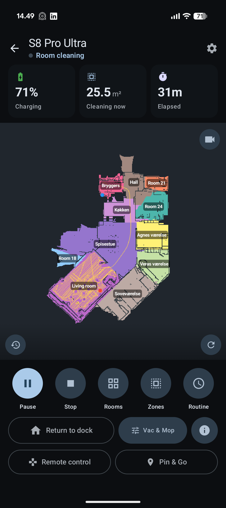
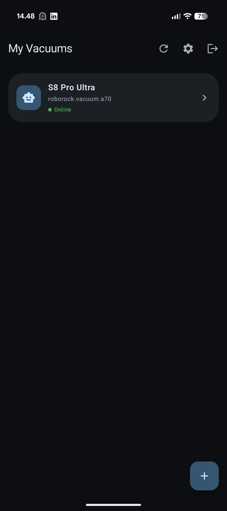
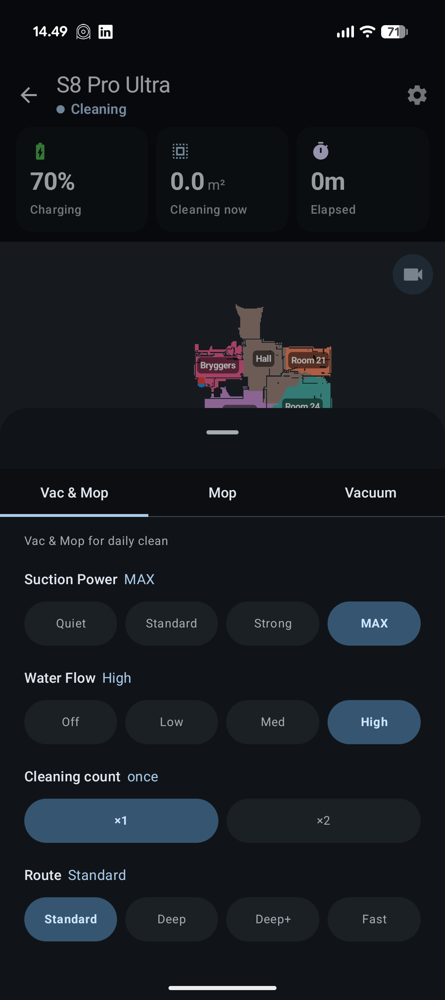
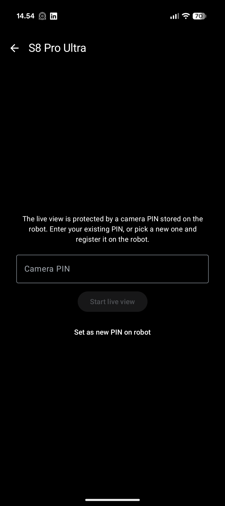
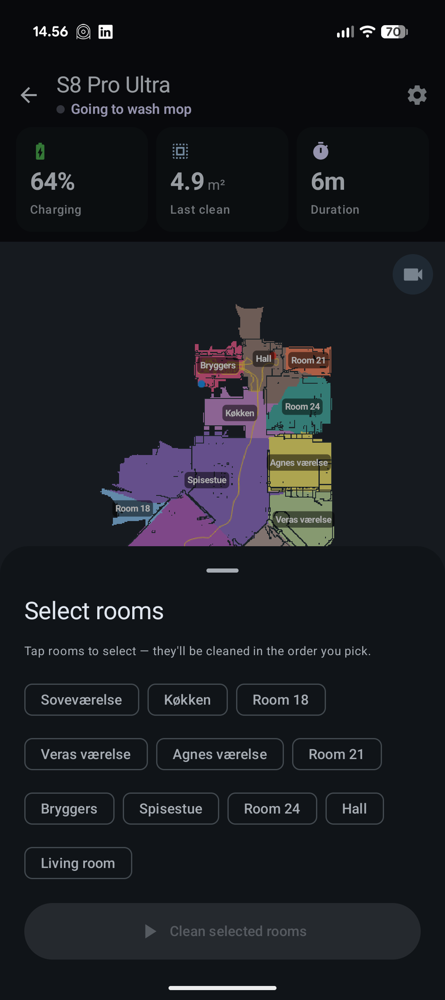
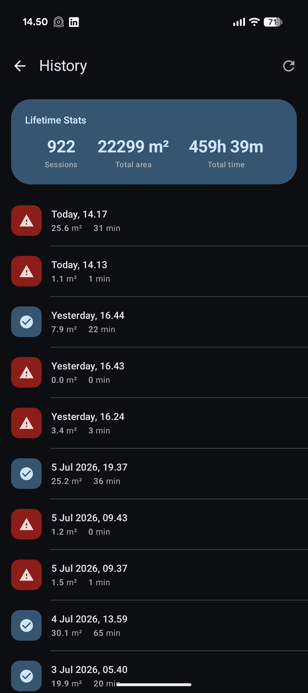
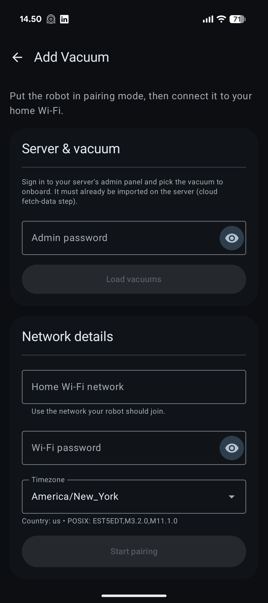
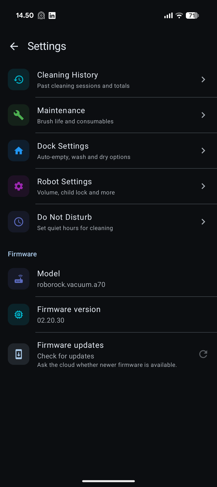
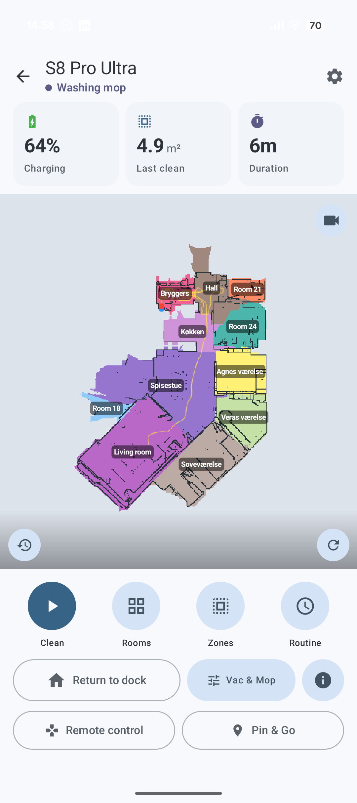

# LocalRock

**A local-network client for Roborock vacuums — control your robot without the Roborock cloud.**

LocalRock is a [Kotlin Multiplatform](https://kotlinlang.org/docs/multiplatform.html) / [Compose Multiplatform](https://www.jetbrains.com/compose-multiplatform/) app (Android + iOS) that talks to a privately‑hosted [local_roborock_server](https://github.com/Python-roborock/local_roborock_server) instead of Roborock's cloud. Onboard, control, map, and live‑view your vacuum entirely on your own network.

<p align="center">
  
</p>

<table align="center"><tr>
  <td valign="middle">
    <a href="https://play.google.com/store/apps/details?id=com.kodraliu.localrock">
      
    </a>
  </td>
  <td valign="middle">
    <a href="https://apps.apple.com/dk/app/localrock/id6788538720">
      
    </a>
  </td>
</tr></table>


> **Not affiliated with, endorsed by, or sponsored by Roborock.** All product names and trademarks are the property of their respective owners. This is an independent, community project.

---

## Table of contents

- [Why LocalRock](#why-localrock)
- [Features](#features)
- [Screenshots](#screenshots)
- [How it works](#how-it-works)
- [Requirements](#requirements)
- [Getting started](#getting-started)
  - [1. Run the local server](#1-run-the-local-server)
  - [2. Build the app](#2-build-the-app)
  - [3. First‑run setup](#3-first-run-setup)
- [Project structure](#project-structure)
- [Tech stack](#tech-stack)
- [Platform status](#platform-status)
- [Building from source](#building-from-source)
- [Troubleshooting](#troubleshooting)
- [Privacy & security](#privacy--security)
- [Support the project](#support-the-project)
- [Contributing](#contributing)
- [License](#license)

---

## Why LocalRock

The official Roborock app routes every command through Roborock's servers. LocalRock is for people who want to keep their robot on the local network:

- **No Roborock cloud dependency** — the app talks only to *your* server.
- **No analytics, no remote logging, no auto‑update, no account creation.**
- **Onboard new vacuums straight from the phone** — no laptop or CLI needed.
- **Open source**, so you can see exactly what it does with your data.

The app implements the Roborock protocol (Hawk‑signed REST + MQTT‑over‑TLS RPC + the V1 message envelope) against the local server's cloud‑emulation API.

---

## Features

- **Live map** — real‑time robot map with zoom/pan, room labels, and tap‑to‑select rooms
- **Full cleaning control** — start / pause / stop / dock, spot & zone cleaning
- **Cleaning modes** — fan power, water/mop level, mop route, and repeat count
- **Room & segment cleaning** — clean specific rooms with real names pulled from your home data
- **Pin‑and‑go** — send the robot to a point on the map
- **Remote control** — manually drive the vacuum
- **Dock controls & settings** — dock actions plus a settings tab
- **Camera live view** — WebRTC video stream from robots with a camera (PIN‑protected) — ⚠️ **untested; not confirmed to work** (see note below)
- **Status & consumables** — battery, state, cleaning stats, filter/brush life
- **Cleaning history**
- **On‑phone onboarding** — provision a brand‑new vacuum over Wi‑Fi from the app
- **Light / dark / system theme**
- **Firmware update check** (opt‑in) — ⚠️ **only works if the server implements the OTA proxy**; without it the app has no cloud to query and the check is unavailable

---

## Screenshots

The app uses a dark theme by default, with a light theme available in settings.

| Map & control | Device list | Cleaning modes | Live view |
| :---: | :---: | :---: | :---: |
|  |  |  |  |

| Room selection | Cleaning history | Add vacuum | Settings |
| :---: | :---: | :---: | :---: |
|  |  |  |  |

Light theme:

<p align="center">
  
</p>

---

## How it works

```
┌──────────────┐      HTTPS (REST, Hawk-signed)      ┌───────────────────────┐      ┌──────────┐
│   LocalRock  │ ──────────────────────────────────▶ │  local_roborock_server │      │ Roborock │
│ (Android/iOS)│ ◀────────── MQTT over TLS ────────▶ │  (cloud emulation +    │ ◀──▶ │  vacuum  │
│              │            (V1 RPC frames)          │   MQTT broker/bridge)  │ MQTT │          │
└──────────────┘                                     └───────────────────────┘      └──────────┘
```

- **REST** — login, home data, device list, firmware check. Requests are Hawk‑signed with credentials issued by the server.
- **MQTT over TLS** — the robot and the app both connect to the server's MQTT broker; the server bridges messages between them. Commands are Roborock **V1 protocol** frames (protobuf/JSON envelope).
- **WebRTC** — camera live view is signaled over the same MQTT dps‑101/102 channel and streams peer‑to‑peer. ⚠️ **This feature has not been tested and is not confirmed to work** — it is implemented from the protocol reference but has not been verified against a real camera‑equipped robot.

The app is **local‑only by design**: there is no Roborock‑cloud login, no server discovery, and no telemetry. The server URL is configured manually.

---

## Requirements

- A running instance of [`local_roborock_server`](https://github.com/Python-roborock/local_roborock_server) reachable over HTTPS on your network, with your vacuum(s) imported into its inventory.
- The server's TLS certificate trusted on your device (install its CA if it's self‑signed — see [Troubleshooting](#troubleshooting)).
- **Android 7.0 (API 24)** or newer.
- **iOS** build requires macOS + Xcode (see [Platform status](#platform-status)).

---

## Getting started

### 1. Run the local server

Follow the setup instructions for [`local_roborock_server`](https://github.com/Python-roborock/local_roborock_server). Note:

- Point the app at the **server root** (e.g. `https://your-host:555`), **not** the `/admin` panel.
- Make sure your vacuum is imported into the server's inventory and connected to its MQTT broker.

### 2. Build the app

**Android:**

```shell
# macOS / Linux
./gradlew :composeApp:assembleDebug

# Windows
.\gradlew.bat :composeApp:assembleDebug
```

The APK lands in `composeApp/build/outputs/apk/debug/`. Install it, or run directly from Android Studio.

**iOS:** open `iosApp/` in Xcode and run (requires macOS — see [Platform status](#platform-status)).

### 3. First‑run setup

On first launch the app walks you through:

1. **Welcome / intro** screen.
2. **Server URL** — enter your server's HTTPS root URL.
3. **Login** — enter the email + login code from your **server setup** (these are your local‑server credentials, not real Roborock credentials).
4. **Device list** — your vacuums appear; tap one to open its map and controls.

To add a new, un‑provisioned vacuum, use the **Add vacuum** flow, which provisions the robot over Wi‑Fi and registers it with the server.

---

## Project structure

Single‑module Compose Multiplatform project:

```
composeApp/src/
├─ commonMain/          # shared Kotlin (UI + logic) for all targets
│  └─ kotlin/com/kodraliu/localrock/
│     ├─ shared/        # non-UI core
│     │  ├─ auth/       # login + credential model
│     │  ├─ device/     # home/device data & repository
│     │  ├─ vacuum/     # VacuumRepository, Commands, map parsing, camera
│     │  ├─ mqtt/       # self-healing MQTT client + transport abstraction
│     │  ├─ onboarding/ # phone Wi-Fi provisioning + admin session API
│     │  ├─ crypto/     # RSA / AES / HMAC / MD5 helpers
│     │  ├─ protocol/   # Roborock V1 message envelope
│     │  ├─ http/       # Ktor client factories + Hawk auth
│     │  └─ webrtc/     # camera peer/video (expect/actual)
│     └─ ui/            # Compose screens: devices, vacuum, settings,
│                       #   login, intro, onboarding, navigation
├─ androidMain/         # Android actuals (OkHttp, KMQTT, libwebrtc)
└─ iosMain/             # iOS actuals (Darwin, Swift-bridged MQTT/WebRTC/RSA)

iosApp/                 # SwiftUI entry point + native bridges
tests/                  # protocol/contract fixtures & tests
```

---

## Tech stack

| Area | Choice |
| --- | --- |
| Language | Kotlin 2.3.x |
| UI | Compose Multiplatform 1.10.x, Material 3 |
| Navigation | AndroidX Navigation‑Compose (typed `@Serializable` routes) |
| Networking | Ktor 3.x (OkHttp on Android, Darwin on iOS) |
| Serialization | kotlinx.serialization (JSON + Protobuf) |
| MQTT | KMQTT on Android; CocoaMQTT (Swift bridge) on iOS |
| Crypto | KotlinCrypto (MD5, HMAC‑SHA2) + platform RSA |
| WebRTC | `io.getstream:stream-webrtc-android` (Android); `WebRTC.framework` (iOS) |
| Settings/persistence | multiplatform‑settings |
| Min SDK / Target | Android 24 / 36 |

---

## Platform status

| Feature | Android | iOS |
| --- | :---: | :---: |
| Core control, map, rooms | Yes | Yes |
| MQTT over TLS | Yes (KMQTT) | Yes (CocoaMQTT bridge) |
| Camera live view (WebRTC) | Implemented, **untested** | Implemented (WebRTC.framework bridge), **untested** |
| RSA (onboarding crypto) | Yes | Yes |
| Phone Wi‑Fi pairing (Add vacuum) | Yes | Not yet implemented |

**Camera live view note:** the WebRTC live feed is implemented from the protocol reference but has **not been tested or confirmed to work** on real hardware. Treat it as experimental.

**iOS note:** Kotlin/Native iOS targets must be built on macOS. The iOS MQTT and WebRTC integrations rely on Swift Package Manager dependencies ([CocoaMQTT](https://github.com/emqx/CocoaMQTT), [WebRTC](https://github.com/stasel/WebRTC)) that must be added to the `iosApp` Xcode target, and the Swift bridge files (`CocoaMqttTransport.swift`, `WebRtcPeer.swift`) added to the target. Pass `nil` for the WebRTC factory to ship without live view. iOS uses a custom bundle identifier that needs signing/provisioning selected in Xcode.

---

## Building from source

**Prerequisites:** JDK 17+, Android SDK, and (for iOS) macOS + Xcode.

```shell
git clone <your-fork-url>
cd LocalRock

# Android debug build
./gradlew :composeApp:assembleDebug

# Run unit tests
./gradlew :composeApp:testDebugUnitTest
```

`gradle.properties` sets `-Xss64m` on the Gradle daemon to avoid a deep‑recursion `StackOverflowError` in Gradle's free‑list allocator on some machines — keep that flag.

---

## Troubleshooting

**"No data" / everything times out on the vacuum screen**
- The app connects to the server's MQTT broker but receives nothing. Confirm the robot is connected to the *server's* broker and the server bridge is running.
- Credentials issued by the server age out. If it was working and stopped, re‑login to refresh the session.

**TLS / can't connect to server**
- If the server uses a self‑signed certificate, install its CA on the device. On iOS the app performs a real trust evaluation — the CA must be installed and trusted.
- Use the server **root** URL (`https://host:555`), not `/admin`.

**Two devices, one works and the other times out**
- Each install generates a unique client id, so multiple devices should coexist. If you built an older revision, update — this was fixed by folding a per‑install id into the MQTT client id.

**Firmware "check unavailable"**
- The firmware check requires the local server to proxy Roborock's OTA endpoint. Without that, the app has no real cloud to ask.

**Room names show as "Room 26"**
- Real names come from your server's `get_home_data`. If the server doesn't return room names, the map falls back to segment ids.

---

## Privacy & security

- **No cloud, no analytics, no remote logging.** The app talks only to the server you configure.
- Auth tokens are excluded from Android cloud/device‑to‑device backup (`allowBackup=false` + backup rules).
- HTTP request/response logging is disabled in release builds (bodies carry secrets).
- Secrets are kept out of logs.

---

## Support the project

LocalRock is free, open source, and built in my spare time. There's no cloud, no subscriptions, and no analytics — just an app that does one thing for people who want their vacuum to stay on the local network.

If it's useful to you and you'd like to help keep it maintained, a small donation goes a long way and is genuinely appreciated. It's never required — the app is and will stay free.

- **GitHub Sponsors** — [github.com/sponsors/donsidro](https://github.com/sponsors/donsidro)
- **Buy Me a Coffee** — [buymeacoffee.com/sidon](https://www.buymeacoffee.com/sidon)

Not able to donate? Starring the repo, filing good bug reports, and contributing fixes help just as much.

---

## Contributing

Contributions are welcome! Please open an issue to discuss substantial changes first. When submitting a PR:

- Keep the app **local‑only** — no code paths that depend on the real Roborock cloud.
- Follow the existing architecture (single `commonMain` core, `StateFlow` view models, manual DI via `AppContainer`, expect/actual for platform bits).
- Run `./gradlew :composeApp:testDebugUnitTest` before submitting.

---

## License

Released under the [MIT License](./LICENSE) — © 2026 Sidon Kodraliu. You're free to use, modify, and distribute it; the software is provided "as is", without warranty.

---

## Acknowledgements

- [`local_roborock_server`](https://github.com/Python-roborock/local_roborock_server) — the self‑hosted backend this client targets.
- [`python-roborock`](https://github.com/humbertogontijo/python-roborock) — reference for the Roborock protocol.
- [go2rtc](https://github.com/AlexxIT/go2rtc) — reference for the camera WebRTC‑over‑MQTT signaling.

> LocalRock is an independent project and is **not affiliated with Roborock**.
